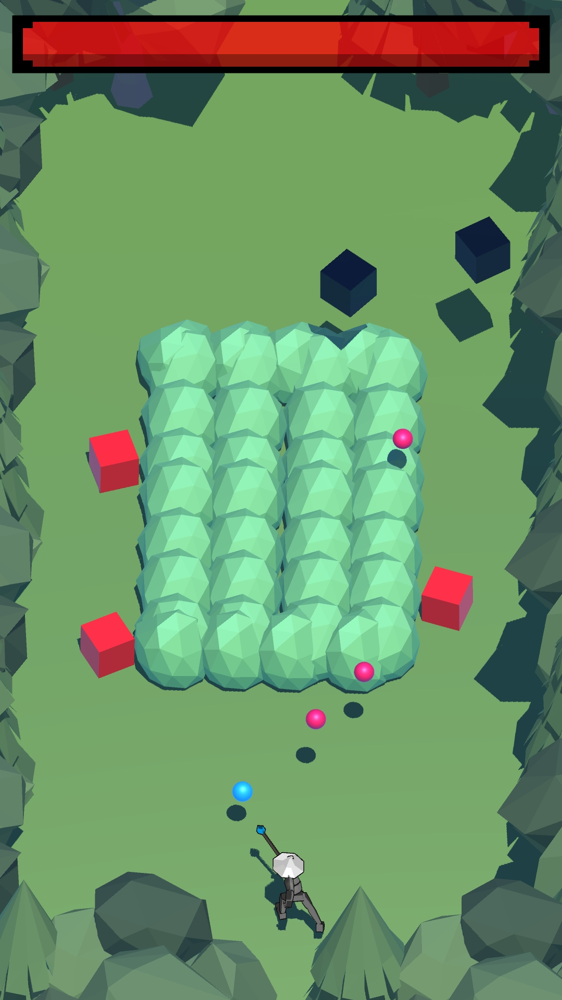

# ArcheroLike

 &nbsp; &nbsp; &nbsp; &nbsp; &nbsp; 

# Credits

Game Engine: 
 - Unity 2019.3, https://unity.com

Unity Assets:
 - Fenerax Studios, https://assetstore.unity.com/packages/tools/input-management/joystick-pack-107631
 - Explosive, https://assetstore.unity.com/packages/3d/animations/warrior-pack-bundle-2-free-42454
 - BOXOPHOBIC, https://assetstore.unity.com/packages/vfx/shaders/free-skybox-extended-shader-107400
 - Broken Vector, https://assetstore.unity.com/packages/3d/vegetation/trees/low-poly-tree-pack-57866
 - JustCreate, https://assetstore.unity.com/packages/3d/environments/landscapes/low-poly-simple-nature-pack-162153
 - Gigel, https://assetstore.unity.com/packages/3d/environments/landscapes/rpg-poly-pack-lite-148410

Other:
 -  Brackeys, https://github.com/Brackeys/Health-Bar

